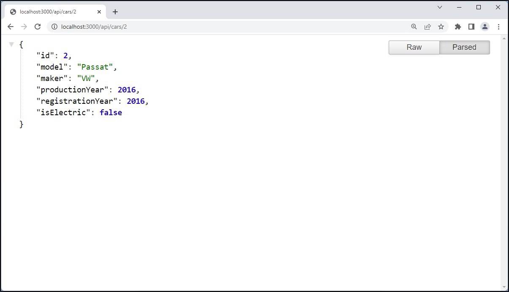
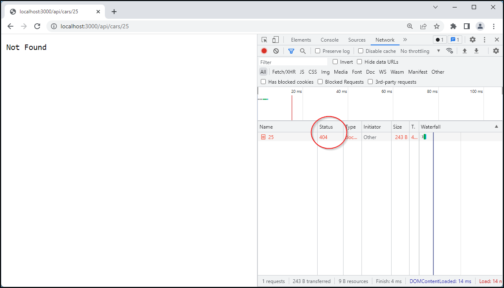

# Garage

Ihre Aufgabe ist die Entwicklung einer Rest API zur Verwaltung der Autos in einer Garage.

## Task 1: Express App

Erstellen Sie in der Datei `app.ts` einen Express-Webserver, der beim Aufruf der URL `http://localhost:3000/` im Webbrowser den Text "Welcome in my garage!" zurücksendet.

## Task 2: Car Repository

**a)** Exportieren Sie aus der Datei `car-repository.ts` das folgende Interface:

```typescript
interface Car {
    id: number;
    model: string;
    maker: string;
    productionYear: number;
    registrationYear: number;
    isElectric: boolean;
}
```

**b)** Befüllen Sie in der gleichen Datei das Array `const cars: Car[]` mit folgenden Daten:

| Model  | Maker  | Production Year | Registration Year | E-Car |
| ------ | ------ | --------------- | ----------------- | ----- |
| Golf   | VW     | 2014            | 2015              | no    |
| Passat | VW     | 2016            | 2016              | no    |
| i3     | BMW    | 2020            | 2021              | yes   |
| Yaris  | Toyota | 2019            | 2019              | yes   |

**Wichtig:** Verwenden Sie für die Vergabe einer eindeutigen ID die Variable `nextId` mit dem Startwert 1.

**c)** Machen Sie das Array von außen zugänglich, indem Sie die Funktion `getAllCars(): Car[]` exportieren.

## Task 3: Read All Cars

Exportieren Sie aus dem Modul `car-router.ts` einen neuen Router und binden Sie diesen für den Pfad `/api/cars` in der `app.ts` ein.

Implementieren Sie anschließend in `car-router.ts` einen Endpunkt, der bei einem GET Request an `/api/cars` alle Autos zurückgibt.

**Hinweis:** Die Autos erhalten Sie natürlich aus dem zuvor implementierten Modul `car-repository.ts`.

**Wichtig:** Testen Sie den Endpunkt im Webbrowser!


## Task 4: Read Car

Exportieren Sie aus dem Modul `car-repository.ts` die Funktion `getCarById(id: number): Car|undefined`. Diese soll das Auto mit der übergebenen  ID zurückgeben. Falls das Auto nicht gefunden werden kann, soll `undefined` zurückgegeben werden.

Implementieren Sie im Modul `car-router.ts` einen Endpunkt, über ein einzelnes Auto von der REST API abgefragt werden kann.

**Hinweis:** Senden Sie einen entsprechenden Statuscode zurück, falls das gesuchte Auto nicht vorhanden ist.

**Wichtig:** Testen Sie den Endpunkt im Webbrowser!





## Task 5: Create Car

Exportieren Sie aus dem Modul `car-repository.ts` die Funktion `addCar(model: string, maker: string, productionYear: number, registrationYear: number, isElectric: boolean): Car`. Diese soll ein neues Auto zum Array `cars` hinzufügen und das neue Auto zurückgeben.

Implementieren Sie im Modul `car-router.ts` einen Endpunkt, der bei einem POST Request an `/api/cars` ein neues Auto speichert und dieses zurücksendet. Die gewünschten Eigenschaften des Autos werden beim HTTP Request mitgesendet.

**Wichtig:** Überprüfen Sie im Route Handler

- ob alle Datentypen korrekt sind
- ob alle Werte sinnvoll sind (z.B. kann das Zulassungsjahr nicht vor dem Herstellungsjahr liegen)

Falls eine der Eigenschaften nicht in Ordnung ist, soll das Auto nicht angelegt werden. Stattdessen ist ein entsprechender Statuscode mit einer aussagekräftigen Fehlermeldung zurückzusenden.

**Tipp:** Testen Sie ihre Implementierung mit dem [Rest Client](https://marketplace.visualstudio.com/items?itemName=humao.rest-client) und der Datei `requests.http`.

## Task 6: Update Car

Implementieren Sie im Modul `car-router.ts` einen Endpunkt, der bei einem PUT Request an `/api/cars/<id>` die Eigenschaften des entsprechenden Autos verändert. Die gewünschten Eigenschaften des Autos werden beim HTTP Request mitgesendet.

**Wichtig:** 

- Senden Sie einen entsprechenden Statuscode zurück, falls das gesuchte Auto nicht vorhanden ist.

- Überprüfen Sie im Route Handler ob alle Datentypen korrekt und alle Werte sinnvoll sind.

**Tipp:** Testen Sie ihre Implementierung mit dem [Rest Client](https://marketplace.visualstudio.com/items?itemName=humao.rest-client) und der Datei `requests.http`.

## Task 7: Delete All Cars

Exportieren Sie aus dem Modul `car-repository.ts` die Funktion `deleteAllCars(): void`. Diese soll alle Autos aus dem Array `cars` entfernen.

Implementieren Sie anschließend in `car-router.ts` einen Endpunkt, der bei einem DELETE Request an `/api/cars` alle Autos löscht.

**Tipp:** Testen Sie ihre Implementierung mit dem [Rest Client](https://marketplace.visualstudio.com/items?itemName=humao.rest-client) und der Datei `requests.http`.

## Task 8: Delete Car

Exportieren Sie aus dem Modul `car-repository.ts` die Funktion `deleteCar(car: Car): void`. Diese soll das übergebene Auto aus dem Array `cars` entfernen.

Implementieren Sie anschließend in `car-router.ts` einen Endpunkt, der bei einem DELETE Request an `/api/cars/<id>` das Auto mit der übergebenen ID löscht.

**Wichtig:** Geben Sie einen entsprechenden Statuscode zurück, falls das gesuchte Auto nicht vorhanden ist.

**Tipp:** Testen Sie ihre Implementierung mit dem [Rest Client](https://marketplace.visualstudio.com/items?itemName=humao.rest-client) und der Datei `requests.http`.
